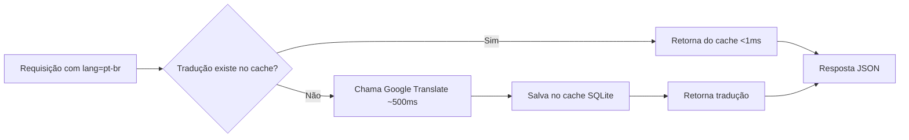

# 🌍 Sistema de Tradução Multilíngue - N8N Workflows

## 📖 Visão Geral

Este sistema adiciona suporte a **3 idiomas** para a documentação dos workflows N8N:

- 🇺🇸 **English (en)** - Idioma padrão
- 🇧🇷 **Português (pt-br)** - Tradução automática
- 🇪🇸 **Español (es)** - Tradução automática

## ✨ Características

- ✅ **Tradução automática** usando Google Translate
- ✅ **Cache em SQLite** para performance máxima
- ✅ **Fallback inteligente** para o texto original se falhar
- ✅ **Seletor de idioma** na interface web
- ✅ **API com suporte a parâmetro `lang`**
- ✅ **Zero custo** (usando API gratuita do Google Translate)
- ✅ **Performance**: traduções cacheadas retornam instantaneamente

## 🏗️ Arquitetura

### Backend

```
src/
├── translation_service.py    # Serviço principal de tradução
└── __init__.py

workflows.db                   # Banco SQLite com tabela translations
```

### Frontend

- Seletor de idioma no cabeçalho
- Estado salvo em `localStorage`
- Recarrega workflows ao trocar idioma

### Scripts

```
scripts/
└── generate_translations.py   # Pré-gera todas as traduções
```

## 📦 Instalação

### 1. Instalar Dependências

```bash
# Ativar ambiente virtual
source venv/bin/activate

# Instalar pacotes necessários
pip install googletrans==4.0.0rc1 tqdm
```

### 2. Iniciar o Sistema

O sistema está pronto para uso! A tabela de traduções é criada automaticamente ao iniciar a API.

```bash
# Iniciar a API
python api_server.py
```

## 🚀 Uso

### Interface Web

1. Acesse a interface: `http://localhost:8000`
2. Selecione o idioma no dropdown: 🇺🇸 English | 🇧🇷 Português | 🇪🇸 Español
3. Os workflows serão recarregados no idioma selecionado

### API REST

#### Buscar Workflows com Tradução

```bash
# Inglês (padrão)
curl "http://localhost:8000/api/workflows?lang=en"

# Português
curl "http://localhost:8000/api/workflows?lang=pt-br"

# Espanhol
curl "http://localhost:8000/api/workflows?lang=es"
```

#### Detalhes de um Workflow

```bash
curl "http://localhost:8000/api/workflows/exemplo.json?lang=pt-br"
```

#### Estatísticas de Tradução

```bash
curl "http://localhost:8000/api/translations/stats"
```

**Resposta:**

```json
{
  "status": "success",
  "stats": {
    "total": 1420,
    "by_language": {
      "pt-br": 710,
      "es": 710
    },
    "top_workflows": [
      ["workflow1.json", 2],
      ["workflow2.json", 2]
    ]
  }
}
```

#### Limpar Cache de Traduções

```bash
# Limpar tudo
curl -X DELETE "http://localhost:8000/api/translations/cache"

# Limpar apenas um idioma
curl -X DELETE "http://localhost:8000/api/translations/cache?language=pt-br"

# Limpar apenas um workflow
curl -X DELETE "http://localhost:8000/api/translations/cache?workflow_id=exemplo.json"
```

#### Listar Idiomas Suportados

```bash
curl "http://localhost:8000/api/translations/languages"
```

**Resposta:**

```json
{
  "status": "success",
  "languages": [
    { "code": "en", "name": "English", "flag": "🇺🇸" },
    { "code": "pt-br", "name": "Português (Brasil)", "flag": "🇧🇷" },
    { "code": "es", "name": "Español", "flag": "🇪🇸" }
  ],
  "default": "en"
}
```

## 🔧 Pré-geração de Traduções

Para melhor performance, recomenda-se pré-gerar todas as traduções:

```bash
# Gerar traduções para todos os workflows
python scripts/generate_translations.py

# Limpar cache e regenerar tudo
python scripts/generate_translations.py --clear

# Ver apenas estatísticas
python scripts/generate_translations.py --stats
```

### Saída Esperada:

```
🌍 Starting translation generation...
📊 Fetching workflows from database...
✅ Found 355 workflows to translate

============================================================
🌐 Generating PT-BR translations...
============================================================

Translating to PT-BR: 100%|████████████| 355/355 [02:30<00:00, 2.36workflow/s]

✅ Completed PT-BR translations

============================================================
🌐 Generating ES translations...
============================================================

Translating to ES: 100%|████████████| 355/355 [02:25<00:00, 2.44workflow/s]

✅ Completed ES translations

============================================================
📊 Translation Generation Complete!
============================================================

Total translations cached: 1420
By language:
  • PT-BR: 710 translations
  • ES: 710 translations

✨ All translations have been generated and cached!
🚀 The API will now serve translated content instantly!
```

## 📊 Campos Traduzidos

Por padrão, os seguintes campos são traduzidos:

- ✅ `name` (Nome do workflow)
- ✅ `description` (Descrição do workflow)

Para adicionar mais campos, edite `TRANSLATABLE_FIELDS` em `src/translation_service.py`:

```python
TRANSLATABLE_FIELDS = ['name', 'description', 'tags']  # Adicione mais campos
```

## 🗄️ Schema do Banco de Dados

```sql
CREATE TABLE translations (
    workflow_id TEXT NOT NULL,      -- ID do workflow (filename)
    field_name TEXT NOT NULL,       -- Campo traduzido (name, description)
    language TEXT NOT NULL,         -- Código do idioma (pt-br, es)
    original_text TEXT NOT NULL,    -- Texto original em inglês
    translated_text TEXT NOT NULL,  -- Texto traduzido
    created_at TIMESTAMP,           -- Data de criação
    updated_at TIMESTAMP,           -- Data de atualização
    PRIMARY KEY (workflow_id, field_name, language)
);

CREATE INDEX idx_translations_lookup
ON translations(workflow_id, language);
```

## ⚡ Performance

- **Primeira tradução**: ~500ms (chamada API Google Translate)
- **Traduções cacheadas**: <1ms (busca no SQLite)
- **Tamanho do cache**: ~2KB por workflow traduzido
- **Cache total** (355 workflows × 2 idiomas): ~1.4MB

## 🔄 Fluxo de Tradução



## 🛠️ Troubleshooting

### Erro: "googletrans not installed"

```bash
pip install googletrans==4.0.0rc1
```

### Traduções não aparecem

1. Verifique se o idioma está correto: `en`, `pt-br` ou `es`
2. Verifique o console do navegador para erros
3. Tente limpar o cache: `DELETE /api/translations/cache`
4. Regenere as traduções: `python scripts/generate_translations.py --clear`

### Performance lenta na primeira vez

Isso é esperado! Use o script de pré-geração:

```bash
python scripts/generate_translations.py
```

### Erro de rate limit do Google Translate

O Google Translate tem limite gratuito. Se atingir o limite:

1. **Opção 1**: Use cache (traduções já geradas funcionam normalmente)
2. **Opção 2**: Aguarde algumas horas e tente novamente
3. **Opção 3**: Considere usar DeepL API (melhor qualidade, mas pago)

Para usar DeepL:

```python
# Edite src/translation_service.py
import deepl

translator = deepl.Translator("YOUR-API-KEY")
translated = translator.translate_text(text, target_lang=lang_code)
```

## 🌟 Próximas Melhorias

- [ ] Adicionar mais idiomas (DE, FR, IT, etc.)
- [ ] Permitir edição manual de traduções
- [ ] Exportar/importar traduções em JSON
- [ ] Suporte a tradução de tags e integrações
- [ ] API endpoint para contribuições da comunidade

## 📝 Licença

Este sistema de tradução segue a mesma licença do projeto principal N8N Workflows.

---

**Desenvolvido com ❤️ para a comunidade N8N**
